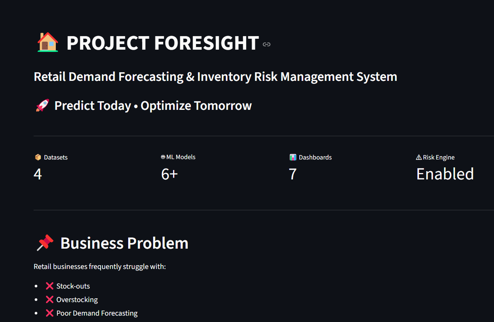
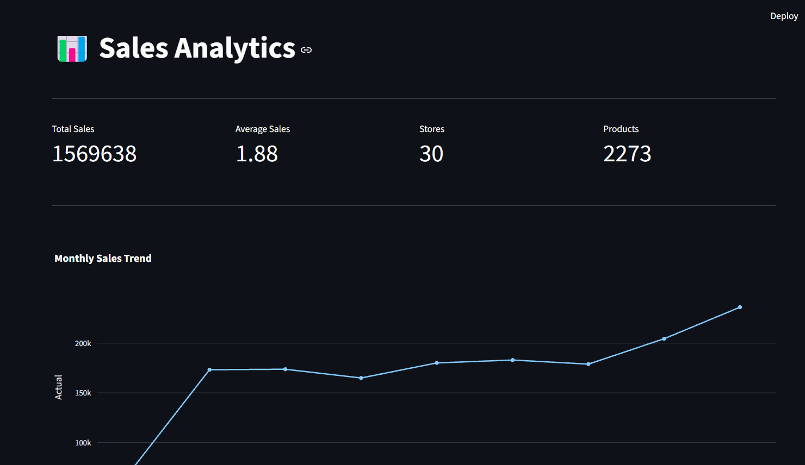
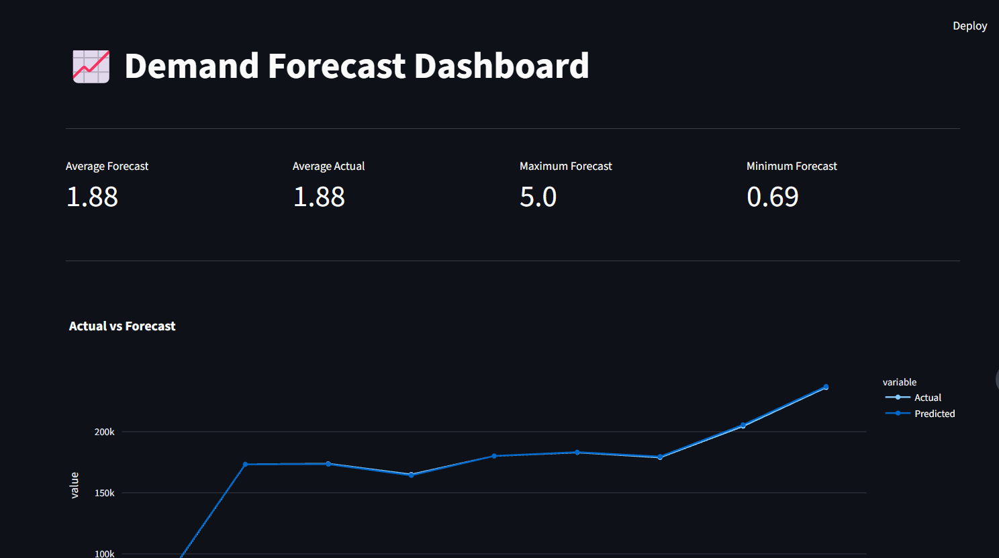
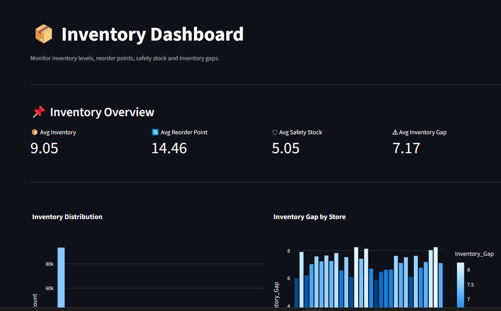
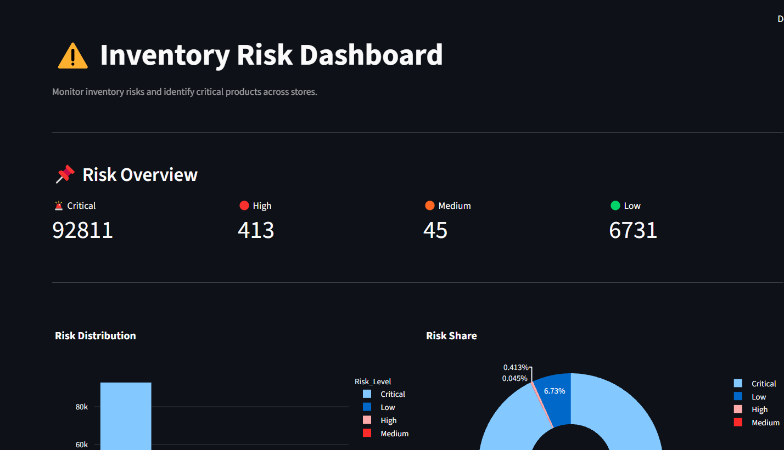
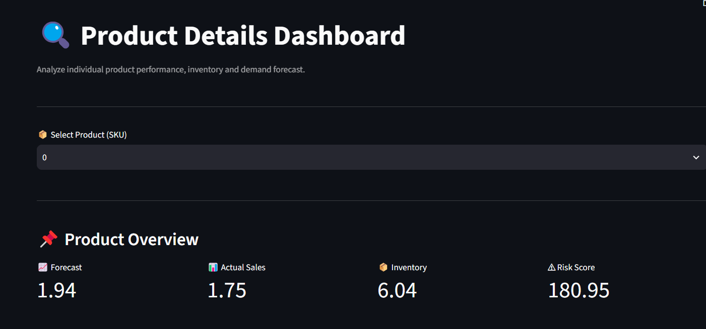
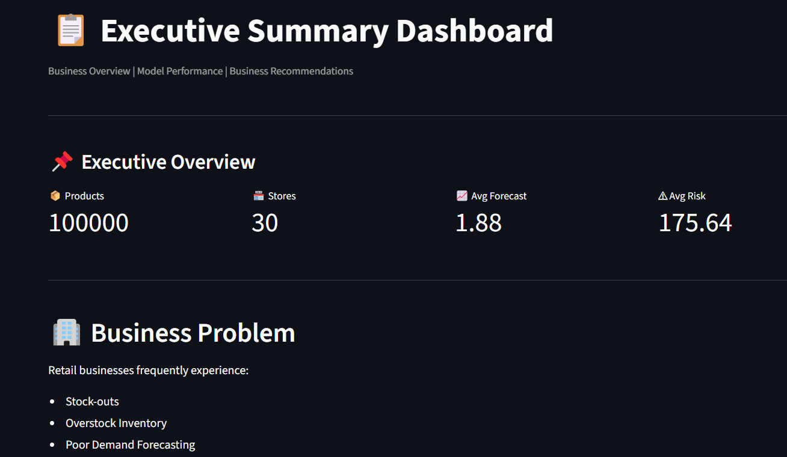

# 📦 Project FORESIGHT

# Retail Demand Forecasting & Inventory Risk Management System

An end-to-end **Machine Learning, Forecasting, Inventory Risk Management, and Business Intelligence** solution designed to forecast retail demand, identify inventory risks, and support data-driven inventory planning through an interactive Streamlit dashboard and REST API.

---

## 📌 Project Overview

Retail businesses often struggle with:

- Stock-outs
- Overstock inventory
- Poor demand forecasting
- High inventory holding costs
- Inefficient reorder planning
- Difficulty identifying high-risk inventory

**Project FORESIGHT** combines data analytics, machine learning forecasting, inventory risk scoring, interactive dashboards, and API-based prediction to support better retail inventory decisions.

The system provides both:

- 📊 Interactive business dashboards
- 🤖 Live demand prediction through FastAPI

---

# 🎯 Business Objectives

- Forecast product demand
- Identify inventory risks
- Reduce stock shortages
- Reduce excess inventory
- Improve inventory planning
- Analyze store and product performance
- Support reorder planning
- Provide actionable business insights
- Enable live demand prediction through an API

---

# 📂 Datasets

The project uses retail sales, product, calendar, and inventory data.

### Main Data Sources

- `sales_daily.csv`
- `sku_master.csv`
- `calendar.csv`
- `inventory_snapshots.csv`

### Processed Datasets

The project also generates processed datasets for:

- Forecasting
- Inventory analysis
- Risk scoring
- Model predictions

Examples:

```text
forecast_dataset.csv
merged_dataset.csv
risk_scored_dataset.csv
predictions.csv
inventory_clean.csv
sales_clean.csv
sku_clean.csv
calendar.csv
```

---

# ⚙️ Project Workflow

```text
Business Understanding
        ↓
Data Collection
        ↓
Data Cleaning
        ↓
Exploratory Data Analysis
        ↓
Feature Engineering
        ↓
Baseline Model
        ↓
Machine Learning Forecasting
        ↓
Model Evaluation
        ↓
Inventory Risk Scoring
        ↓
Streamlit Dashboard
        ↓
FastAPI Prediction API
        ↓
Cloud Deployment
        ↓
Executive Insights
```

---

# 🧠 Machine Learning

Multiple forecasting approaches were evaluated during the project.

### Models

- Baseline Forecast
- Random Forest
- XGBoost
- LightGBM
- Prophet
- ARIMA / SARIMA

### Evaluation Metrics

Models were evaluated using:

- MAE
- RMSE
- MAPE
- R² Score

The selected forecasting model is an **XGBoost Regressor**, which is saved as:

```text
models/best_forecasting_model.pkl
```

---

# 🔧 Feature Engineering

The forecasting model uses features including:

### Product & Business Features

- Store ID
- SKU ID
- Category
- Channel
- Unit Price
- Discount Percentage

### Inventory Features

- Stock on Hand
- Reorder Point
- Safety Stock
- Stock Gap

### Time Features

- Year
- Month
- Week
- Day
- Day of Week
- Weekend Indicator

### Historical Demand Features

- Lag 1
- Lag 7
- Lag 30
- Rolling 7
- Rolling 30

These features allow the model to capture historical demand patterns and inventory conditions.

---

# 📊 Streamlit Dashboard

The Streamlit application contains seven interactive pages:

- 🏠 Home
- 📊 Sales Analytics
- 📈 Forecast Dashboard
- 📦 Inventory Dashboard
- ⚠️ Risk Dashboard
- 🔍 Product Details
- 📋 Executive Summary

### Dashboard Capabilities

- KPI monitoring
- Sales analysis
- Demand forecasting
- Inventory analysis
- Stock risk identification
- Product-level analysis
- Store-wise analysis
- Category-wise analysis
- Weekly and monthly trends
- Executive recommendations

---

# 🤖 Live Demand Prediction

Project FORESIGHT includes a live prediction system using **Streamlit + FastAPI + XGBoost**.

### Prediction Workflow

```text
User Input
    ↓
Streamlit Dashboard
    ↓
Feature Preparation
    ↓
Categorical Encoding
    ↓
FastAPI REST API
    ↓
XGBoost Model
    ↓
Predicted Demand
    ↓
Streamlit Result
```

The Streamlit application allows users to select:

- Store
- SKU
- Forecast Date
- Unit Price
- Discount
- Stock on Hand
- Reorder Point
- Safety Stock

Historical features such as:

- Lag 1
- Lag 7
- Lag 30
- Rolling 7
- Rolling 30

are automatically retrieved from the processed forecasting dataset.

Categorical mappings are stored in:

```text
models/encoders.pkl
```

This ensures that the same encoding used during model training is applied during live prediction.

---

# 🚀 FastAPI Prediction API

The project provides a REST API for demand prediction.

### API Endpoint

```text
POST /predict
```

### Example Response

```json
{
    "Predicted_Demand": 3.3897080421447754
}
```

The API is deployed using Render.

### 🌐 Live API

**FastAPI / Render**

https://project-foresight-gs0h.onrender.com

The `/predict` endpoint is used by the Streamlit dashboard for live demand forecasting.

---

# 📸 Dashboard Screenshots

## 🏠 Home



---

## 📊 Sales Analytics



---

## 📈 Forecast Dashboard



---

## 📦 Inventory Dashboard



---

## ⚠️ Risk Dashboard



---

## 🔍 Product Details



---

## 📋 Executive Summary



---

# ✨ Key Features

- 📈 Retail Demand Forecasting
- 🤖 XGBoost Demand Prediction
- 🚀 FastAPI REST API
- ☁️ Cloud API Deployment
- 📊 Interactive Streamlit Dashboard
- ⚠️ Inventory Risk Scoring
- 📦 Inventory Gap Analysis
- 🏪 Store-wise Performance Analysis
- 🏷️ Category-wise Demand Analysis
- 🛒 Sales Channel Analysis
- 📅 Weekly & Monthly Forecast Analysis
- 📉 Historical Demand Analysis
- 📋 Executive Business Insights
- 📊 Interactive Plotly Visualizations
- 🔄 Automatic Forecast Feature Retrieval
- 🔢 Consistent Categorical Encoding

---

# 🛠️ Tech Stack

| Category | Technologies |
|---|---|
| Programming | Python |
| Data Analysis | Pandas, NumPy |
| Machine Learning | Scikit-learn, XGBoost, LightGBM |
| Visualization | Plotly |
| Dashboard | Streamlit |
| API | FastAPI |
| API Server | Uvicorn |
| Model Serialization | Joblib |
| Development | VS Code, Jupyter Notebook |
| Version Control | Git & GitHub |
| Deployment | Streamlit Cloud, Render |

---

# 📁 Project Structure

```text
Project_FORESIGHT/
│
├── data/
│   ├── raw/
│   └── processed/
│
├── models/
│   ├── best_forecasting_model.pkl
│   └── encoders.pkl
│
├── notebooks/
│   ├── 01_Business_Understanding.ipynb
│   ├── 02_Data_Collection.ipynb
│   ├── 03_Data_Cleaning.ipynb
│   ├── 04_EDA.ipynb
│   ├── 05_Feature_Engineering.ipynb
│   ├── 06_Baseline_Model.ipynb
│   ├── 07_ML_Forecasting.ipynb
│   ├── 08_Model_Evaluation.ipynb
│   ├── 09_Risk_Scoring.ipynb
│   ├── 10_Streamlit_Dashboard.ipynb
│   ├── 11_Deployment.ipynb
│   └── 12_Executive_Summary.ipynb
│
├── screenshots/
│   ├── home.png
│   ├── sales.png
│   ├── forecast.png
│   ├── inventory.png
│   ├── risk.png
│   ├── product.png
│   └── executive.png
│
├── fastapi_app/
│   ├── app.py
│   ├── predict.py
│   ├── schema.py
│   └── requirements.txt
│
├── streamlit_app/
│   ├── app.py
│   ├── charts.py
│   ├── kpi.py
│   ├── sidebar.py
│   ├── tables.py
│   ├── utils.py
│   ├── api.py
│   ├── style.css
│   ├── assets/
│   └── pages/
│
├── requirements.txt
├── README.md
├── LICENSE
└── .gitignore
```

---

# 🚀 Installation

## 1. Clone Repository

```bash
git clone https://github.com/kumarhitesh3464-max/Project_FORESIGHT.git
```

## 2. Move into Project Directory

```bash
cd Project_FORESIGHT
```

## 3. Install Dependencies

```bash
pip install -r requirements.txt
```

## 4. Run Streamlit Dashboard

```bash
python -m streamlit run streamlit_app/app.py
```

---

# 🌐 Live Demo

## 📊 Streamlit Dashboard

https://projectforesight-bxhzjwsvddgpwxvgzuatd8.streamlit.app/

## 🚀 FastAPI

https://project-foresight-gs0h.onrender.com

## 💻 GitHub Repository

https://github.com/kumarhitesh3464-max/Project_FORESIGHT

---

# 📌 API Usage

### Endpoint

```text
POST /predict
```

### Request Example

```json
{
    "store_id": 1,
    "sku_id": 101,
    "category": 1,
    "channel": 1,
    "unit_price": 500,
    "discount_pct": 10,
    "stock_on_hand": 200,
    "reorder_point": 50,
    "safety_stock": 30,
    "year": 2026,
    "month": 8,
    "week": 31,
    "day": 7,
    "day_of_week": 5,
    "is_weekend": 0,
    "lag_1": 120,
    "lag_7": 118,
    "lag_30": 115,
    "rolling_7": 119,
    "rolling_30": 117,
    "stock_gap": 150
}
```

### Response

```json
{
    "Predicted_Demand": 3.3897080421447754
}
```

---

# 📈 Business Insights

Project FORESIGHT enables businesses to:

- Identify products with high expected demand
- Detect potential stock-out situations
- Monitor excess inventory
- Compare store performance
- Analyze category demand
- Understand sales trends
- Improve inventory planning
- Support data-driven reorder decisions

---

# 🔮 Future Improvements

- Real-time database integration
- Automated data pipeline
- Automated model retraining
- Advanced time-series forecasting
- Deep learning forecasting models
- Real-time inventory alerts
- Automated reorder recommendations
- Cloud database integration
- Advanced model monitoring
- Mobile-responsive dashboard

---

# 👨‍💻 Author

**Hitesh Kumar**

Data Analytics | Machine Learning | Business Intelligence

### GitHub

https://github.com/kumarhitesh3464-max

### LinkedIn

https://www.linkedin.com/in/hitesh-kumar-050521330/

---

# 📄 License

This project is licensed under the **MIT License**.
